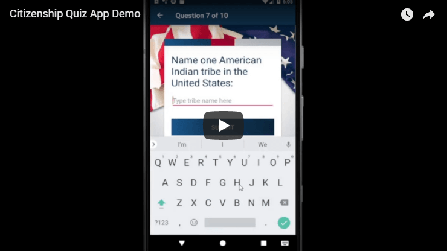
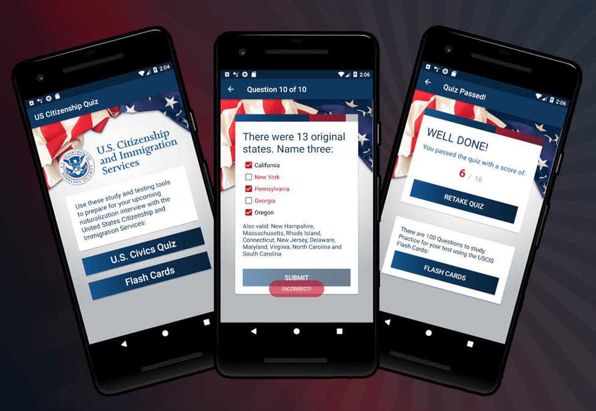
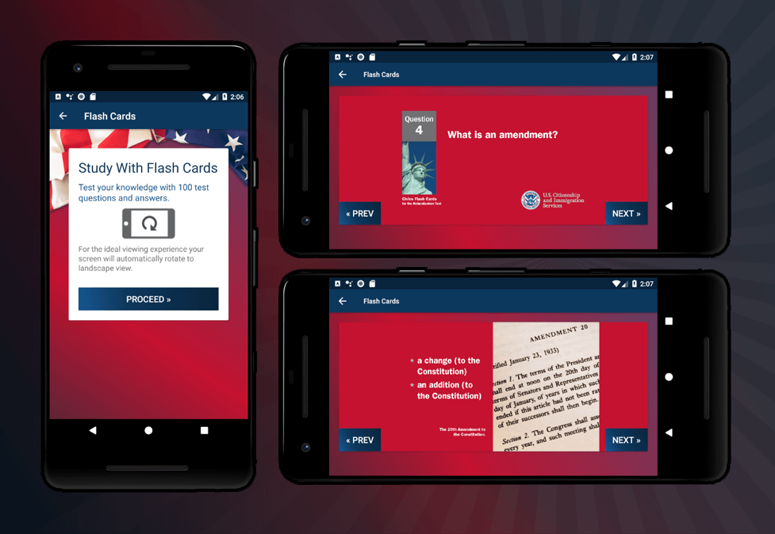

# US Citizenship Quiz App

**Created for the *Grow with Google Challenge Scholarship:* Android Basics Course**

Used **API 23: Android 6.0 (Marshmallow)**

## Quiz App Project Rubric 
https://review.udacity.com/#!/rubrics/158/view

## Video Walkthrough

## Screenshots

The Flash Card portion of the app is restricted in the code to display in portrait mode for best viewing.

## Additional Features Not In The Course or Required
1. Custom app icon
2. Multiple scrollable activities instead of one scrolling activity
3. Progress Bar (primary and secondary)
4. Custom shapes and gradients
5. Flash card activity with scrollable views
